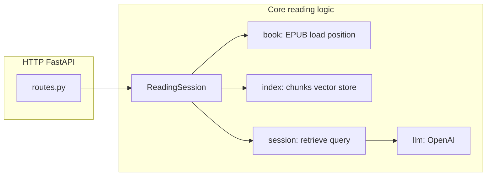

# Readtard backend — what we built

This document describes the **Python backend** in this repository: its purpose, main parts, and how they fit together. It is **not** a Swift or API-tutorial doc; for client integration details see [`FRONTEND_INTEGRATION.md`](FRONTEND_INTEGRATION.md).

---

## Purpose

**Readtard** is a **spoiler-aware reading assistant** for fiction. Given a user’s **current position** in a book (expressed as a **verbatim text snippet** for now) and a **natural-language question**, the backend answers using:

- **Only** text from **at or before** that position in the story (plus retrieved chunks that obey the same boundary), and  
- An LLM with instructions **not** to use outside knowledge about the book.

So the core idea is: **reader position → safe retrieval window → grounded answer**, not open-book trivia from the whole title.

---

## High-level architecture

- **`app/main.py`** — FastAPI application: on startup it loads environment variables, constructs **one shared LLM**, and initializes an **empty in-memory cache** of `ReadingSession` instances (one per book id when first needed). There is **no default book** preloaded.
- **`app/api/`** — HTTP layer: JSON schemas, route handlers, and a small **session pool** helper that lazily creates a `ReadingSession` per `book_id`.
- **`app/library/`** — **On-disk book discovery**: where EPUBs live, how `book_id` maps to files, optional `metadata.json` per book.
- **`app/book/`** — EPUB → plain text in **spine order**, **snippet → reader position** (spine index + character offset), **narrow context window** around the reader for deictic references (“this”, “here”).
- **`app/index/`** — **Chunking**, **metadata** so each chunk has an end position in a global “spine + offset” ordering, **persisted vector index** per EPUB file, and a **reader boundary** used to filter retrieval.
- **`app/session/`** — **Spoiler-safe retrieval** (vector search with metadata filter), optional merge of “read-so-far” partial chunk, **response synthesis** or passage-only answer via LlamaIndex + prompts in **`app/prompts/`**.
- **`app/llm/`** — Factory for the OpenAI chat model and **system prompt** text for spoiler-safe behavior.
- **`app/config.py`** — Tunables (chunk sizes, retrieval top-k, LLM model name, etc.). **Book identity is not configured here**; the client must send `book_id` on every ask.

Data on disk:

- **`data/books/<book_id>/`** — **Exactly one** `*.epub` per folder; optional **`metadata.json`** with a `"title"` for listing.
- **`persist_dir/`** — Generated vector index storage (gitignored); derived from the EPUB’s file identity.

---

## Spoiler safety (how it works)

1. **Position** — The reader supplies a **snippet** that must match **exactly one** place in the flattened plain text of the EPUB (`resolve_position_from_snippet`). That yields a **sort key** representing “how far through the book” the reader is.
2. **Chunks** — The book is split into chunks with metadata so each chunk knows its **end position** in the same ordering.
3. **Retrieval** — Vector search runs with a **metadata filter**: only chunks **at or before** the reader’s position are candidates. That prevents later-chapter spoilers from entering the context.
4. **Answering** — The LLM gets retrieved passages plus a **small local window** of text around the reader for resolving references; prompts in **`app/prompts/query_prompts.py`** and **`app/llm/system_prompts.py`** reinforce evidence-only answers.

Audiobook support is **prepared at the API shape** (`source: audiobook` + `timestamp_sec`) but **not implemented**: those requests return **501** until a future layer maps **audio time → the same position representation** used for ebooks.

---

## HTTP API (what exists today)

| Endpoint | Role |
|----------|------|
| `GET /health` | Returns `{ status, ready }` after startup. |
| `GET /books` | Lists books found under `data/books/*/`. |
| `GET /books/{book_id}/epub` | Serves the **same EPUB file** the server indexes (for mobile ereader sync). |
| `POST /ask` | **Required:** `book_id`, `question`, `source`, and position payload. For `source: ebook`, a **snippet** is required. Returns `{ answer }` or validation / business errors. |

There is **no authentication** and **no multi-tenant isolation**; it is aimed at **local development** and **single-user demos**. Sessions and indices live **in the server process**; restarting the process drops in-memory sessions (indices remain on disk under `persist_dir/`).

OpenAPI UI: **`/docs`** when the server is running.

---

## How to run the server

- **Package script:** `readtard` → runs Uvicorn (see **`app/cli.py`**); host/port overridable via `READTARD_HOST`, `READTARD_PORT`, `READTARD_RELOAD`.
- **Alternative:** `uvicorn app.main:app --host 0.0.0.0 --port 8000`.

**CLI demo without HTTP:** `python -m app.demo` — uses a **hard-coded `DEMO_BOOK_ID`** in that file and `force_reindex=True` for a one-off terminal test.

---

## Dependencies (stack)

- **Python ≥ 3.11**
- **LlamaIndex** — ingestion, vector index, retrievers, response synthesizer
- **ebooklib** — EPUB parsing
- **FastAPI + Uvicorn** — HTTP API
- **python-dotenv** — load `.env` (e.g. API keys)

LLM calls require **OpenAI** credentials in the environment (typical for LlamaIndex OpenAI integration).

---

## What we deliberately did *not* build yet

- User accounts, API keys, or rate limiting  
- Persistent **server-side** reading state beyond files on disk  
- **Audiobook → text position** mapping  
- Streaming responses  
- Hosted vector DB or shared storage for Cloud scale (the design is still **single-process, filesystem-backed**)

Those are natural next steps if the product moves beyond a **local / single-book demo**.

---

## Related docs

- **[`FRONTEND_INTEGRATION.md`](FRONTEND_INTEGRATION.md)** — what to implement in the Swift app to call this API.  
- **`readtard_backend_plan.md`** (repo root) — original integration milestone notes (may drift as the code evolves).
